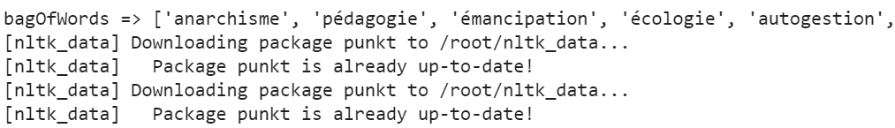
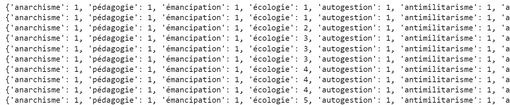
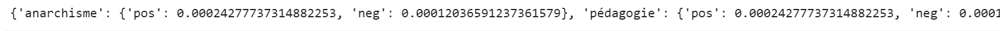
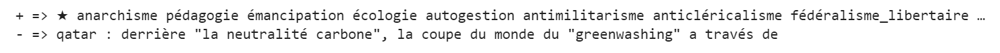
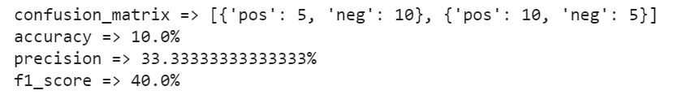
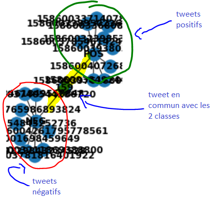

# Introduction
Implémentation de l'algorithme **NAIVE BAYE** dans le cadre d'un traitement de tweets. L'objectif est de déterminer si un tweet est classé comme 'positif' ou 'négatif' vis a vis du sujet de l'écologie.

### --- Preprocessing ---

### --- Vectorization ---

### --- Apprentissage ----

### --- Evaluation ----

# Graphe
Ce graphe représente les tweets positifs qui ont été aimés par des utilisateurs qui ont aimés des tweets négatifs et inversement.
Il permet de mettre en évidence les évuentels liens entre les 2 classes.

# Conclusion
La precision est relativement basse, l'accuracy & le score F1 aussi, mais ils sont assez proche.

Le réseau manque de données
