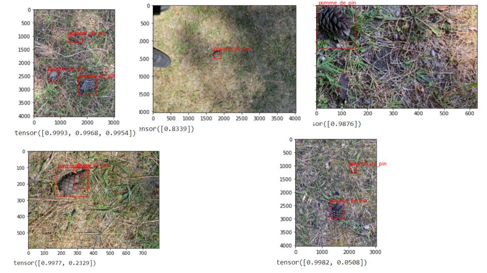

# Projet Deep Learning

## Description
#### Entrainement d'un réseau de neurone pour reconnaitre des pommes de pin

## Architecture
#### Faster R-CNN sur ResNet 50

## Language utilisé
#### Python

## Temps
#### 4 jours

## Resultats

