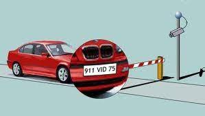
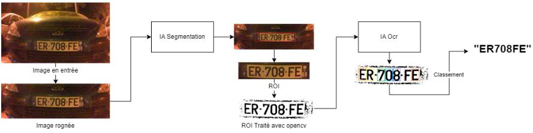
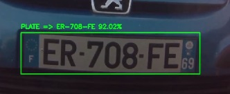
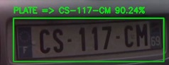
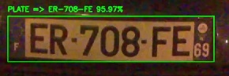
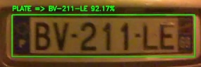

# Prototype IA de reconnaissance de plaque d'immatriculation pour la solution Self-Car

## Description

Dans le cadre de mon alternance chez mediatouch, j'ai créé une Intelligence Artificielle de reconnaissance de plaques d'immatriculation. Cette IA innovante automatise la lecture des plaques d'immatriculation pour diverses applications. Son objectif est de permettre une gestion plus rapide des informations relatives aux véhicules.

## Architecture & Outils
- Python
- Yolo v8
- Segmentation & Object Detection

## Temps
- 6 mois

## Résultats
- demo : https://www.youtube.com/watch?v=25r-kjp4JbQ

